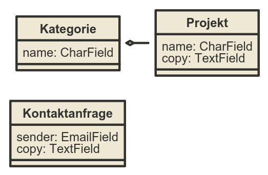

Ein Portfolio
--------------------------

* Seiten

   * Startseite mit Projektübersicht
   * Projektdetailseite
   * Kontaktformular

* Design nach Bedarf
  (http://getbootstrap.com/)

----

Datenmodell für unsere Seite
----------------------------

.. comment:
   http://www.nomnoml.com/#view/#direction:%20right%0A#edgeMargin:10%0A#zoom:1.5%0A%0A%0A[Kategorie|%0A%20%20Name:%20CharField%0A|]%0A[Projekt|%0A%20%20Name:%20CharField%0A%20%20Beschreibung:%20TextField%0A|]%0A[Kategorie]o-[Projekt]%0A%0A[Kontaktanfrage|%0A%20%20Absender:%20EmailField%0A%20%20Text:%20TextField%0A|]

   #direction: right
   #edgeMargin:10
   #zoom:1.5

   [Kategorie|
     name: CharField
   |]
   [Projekt|
     name: CharField
     copy: TextField
   |]
   [Kategorie]o-[Projekt]

   [Kontaktanfrage|
     sender: EmailField
     copy: TextField
   |]

----

virtualenv (venv)
-----------------

* Kapseln der Python Pakete in einer unabhängigen "Installation"
* Unterschiedliche Projekte können unterschiedliche Abhängigkeiten bekommen
* Volle Unterstützung von pip
* Keine root-Rechte für Installation von Paketen

----

venv einrichten
---------------

.. code-block:: console

   user@hostname:$ virtualenv venv
   New python executable in venv/bin/python
   Installing setuptools, pip...done.

   user@hostname:$ source venv/bin/activate

   (venv)user@hostname:$ deactivate

   user@hostname:$

.. note::
   Man kann auch virtualenv wrapper verwenden.
   Je nach Situation kann dieser Arbeit abnehmen.

   http://virtualenvwrapper.readthedocs.org/en/latest/

----

django installieren
--------------------

.. code-block:: console

   $ pip install django==1.11.*
   $ pip install psycopg2 # Für Postgres
   $ pip install Pillow   # Für Bilder
   $ pip freeze

.. warning::
	Für diesen Befehl und für alle weiteren Befehle muss man die venv aktiviert haben.

----

django installieren 2
--------------------------

.. code-block:: console

   $ python -c "import django; print(django.get_version())"
   1.8.15

----

Das django admin tool
---------------------

.. code-block:: console

   $ django-admin startproject portfolio

----

:class: slidecenter

Was wurde erstellt?
---------------------

.. note::
   Besonders wichtig sind:

     * manage.py
     * settings.py
     * urly.py
     * wsgi.py

----

runserver
---------

* Einfacher debugging Server
* NICHT(!) produktiv nutzen
* autoreload (fehlerhaft)

----

runserver starten
------------------

.. code-block:: console

   $ python manage.py runserver 0.0.0.0:8000
   Performing system checks...

   System check identified no issues (0 silenced).

   You have unapplied migrations; your app may not work properly until they are applied.
   Run 'python manage.py migrate' to apply them.

   October 04, 2017 - 16:32:20
   Django version 1.11.6, using settings 'portfolio.settings'
   Starting development server at http://127.0.0.1:8000/
   Quit the server with CONTROL-C.

----

It worked!
---------------------

.. image:: ../_static/screenshots/django-startproject.png
    :width: 100%

.. note::
   Im runserver sieht man logs aller requests
   Strg + C zum Beenden
