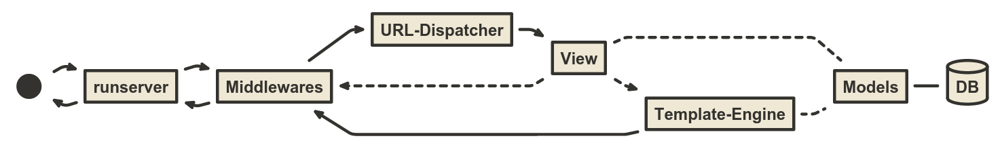

Die erste "App" erstellen
--------------------------

* Apps sind gekapselte Plugins für django
* "Alles" muss und wird in einer App gekapselt

.. code-block:: console

   $ python manage.py startapp core

----

:class: slidecenter

Was wurde erstellt?
---------------------

.. note::
   live demo

----

App in den ``INSTALLED_APPS``  eintragen
------------------------------------------

in ``portfolio/settings.py``

.. code-block:: python

   INSTALLED_APPS = (
       'django.contrib.admin',
       'django.contrib.auth',
       'django.contrib.contenttypes',
       'django.contrib.sessions',
       'django.contrib.messages',
       'django.contrib.staticfiles',
       'core',
   )

----

Die erste View
----------------

In ``core/views.py``:

.. code-block:: python
   
   from django.http import HttpResponse
   
   def index(request):
       return HttpResponse("hello world!")

----

URL-Mapping
------------

* URLs sind so wichtig wie Code
* Keine IDs! Slugs!
* http://en.wikipedia.org/wiki/Semantic_URL

----

App urls.py
------------

``core/urls.py``

.. code-block:: python

   from django.conf.urls import patterns, url
   from core import views
   
   urlpatterns = patterns('',
           url(r'^$', views.index, name='index'))

.. note::
   Viele regex Möglichkeiten, unter anderem mit Variablenzuweisung. 

Importieren in der globalen Datei
----------------------------------

``urls.py``

.. code-block:: python

   urlpatterns = patterns('',
       url(r'^core/', include('core.urls')),
   )

.. note::
   In der realen Welt wird man das vermutlich nicht so sauber trennen. Hier für den Workshop arbeiten wir aber so sauber wie möglich!

----

Recap: Wo stehen wir gerade?
-----------------------------

