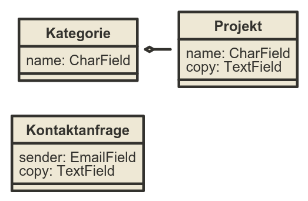

Das erste Model
---------------

----

Datenbank
-----------

* PostgreSQL
* MySQL
* SQLite
* Oracle

----

SQLite
------------

``portfolio/settings.py``

.. code-block:: python
   
   DATABASES = {
       'default': {
           'ENGINE': 'django.db.backends.sqlite3',
           'NAME': os.path.join(PROJECT_PATH, 'portfolio.db'),
       }
   }

.. warning::
   Niemals SQLite produktiv nutzen

----

PostgreSQL
-----------

``portfolio/settings.py``

.. code-block:: python

   DATABASES = {
       'default': {
           'ENGINE': 'django.db.backends.postgresql_psycopg2',
           'NAME': 'db_name',                      
           'USER': 'db_user',
           'PASSWORD': 'db_user_password',
           'HOST': ''
       }
   }
   

----

Models
-------

* Beschreibung von Daten in Python-Objekten
* Wir bekommen "geschenkt":

  * auto Validierungen
  * auto Forms
  * auto Admin

----

Models
-------

``core/models.py``

.. code-block:: python

  class Project(models.Model):
      category = models.ForeignKey("Kategorie", related_name="projects", null=True)
      name = models.CharField(max_length=128, unique=True)
      def __unicode__(self):
          return self.name

  class Kategorie(models.Model):
      name = models.CharField(max_length=128, unique=True, help_text="Der Name")
      def __unicode__(self):
          return self.name

----

Model Feld Typen
-----------------

* CharField / TextField
* URLField
* IntegerField
* BooleanField
* ImageField
* DateField
* ForeignKey / OneToOneField / ManyToManyField
* ...

.. note::
   https://docs.djangoproject.com/en/1.6/ref/models/fields/

----

Datenbank erstellen
--------------------

.. code-block:: console

   $ python manage.py syncdb

.. note::
   Syncdb erstellt nur ganze Models. Bei Änderungen muss das alte Model in der Datenbank erst gelöscht werden!

----

Erstelles SQL
--------------------------

.. code-block:: console

   $ python manage.py sql core

----

Shell debugging
----------------

.. code-block:: console

   $ python manage.py shell

----

Shell debugging 2
-------------------

.. code-block:: python

   >>> from core.models import Project
   
   >>> print Project.objects.all()
   [] 
   
   >>> p = Project(name="Test")
   >>> p.save()
   
   >>> print Project.objects.all()
   [<Project: Test>]
   
   >>> quit()

.. note::
   * Daten lesen / schreiben:

     * all()
     * filter(...)
     * get(...)
     * order()
     * save()
     
   * Chaining bei QuerySets
   * Field Lookups
   * Genelle Informationen zum Query erstellen: https://docs.djangoproject.com/en/1.6/topics/db/queries/

----

:class: slidecenter

django Admin
----------------

.. note::
  Über Introspection, vergleiche Ruby on Rails.

----

django Admin: aktivieren
------------------------

.. code-block:: python

   INSTALLED_APPS = (
       'django.contrib.admin',
       'django.contrib.auth',
       'django.contrib.contenttypes',
       'django.contrib.sessions',
       'django.contrib.messages',
       'django.contrib.staticfiles',
       'django.contrib.admin',         #hier
       'core',
   )

.. note::
   Bei neuen django Installationen ist der Admin schon aktiviert. 

----

:class: slidecenter

django Admin Demo
------------------

.. note::
      
    /admin

----

Models am admin registrieren
------------------------------

``core/admin.py``

.. code-block:: python
   
   from django.contrib import admin
   from core.models import Project
   
   admin.site.register(Project)
   
----

Populate-Skript
-----------------

``populate.py``

.. code-block:: python

   def populate():
       Project.objects.get_or_create(name="myProject")
       #....
       
       for p in Project.objects.all():
           print p
   
   if __name__ == '__main__':
       print "Starting Population script..."
       os.environ.setdefault('DJANGO_SETTINGS_MODULE', 
           'portfolio.settings')   
       from core.models import Project
       populate()

----

Der Adminuser im Template
--------------------------

.. code-block:: html

   
      nice to see you
   
      who are you
   

----

:class: slidecenter

Admin Showcase
--------------

Was so geht ...